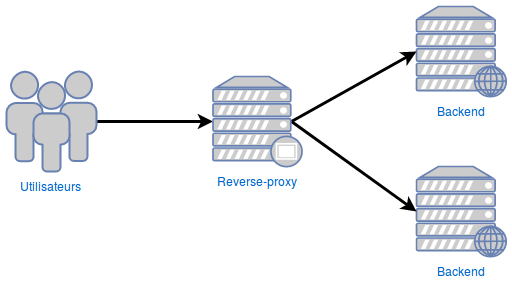

# Docker Compose | NGINX Reverse Proxy

This repo is a docker composer created to link a frontend application (React in this example) to a backend API on the /api route

## Installation
1 - Drop the source code of your api inside `api/`, be sure to keep the `config.js` and implement it in your input file

2 - Drop the source code of your React application, inside `frontend/` and make sure you also implement the `config.js` file correctly.

3 - **(If you are not using Parcel)** Change on the line 9 `docker-nginx-revproxy/frontend/Dockerfile`

Change : ```COPY --from=build /app/dist /usr/share/nginx/html```  
To (example for CRA) : ```COPY --from=build /app/build /usr/share/nginx/html```

4 - Clone this repo and run `docker-compose up --build`

5 - Look at `http://localhost` and `http://localhost/api`



